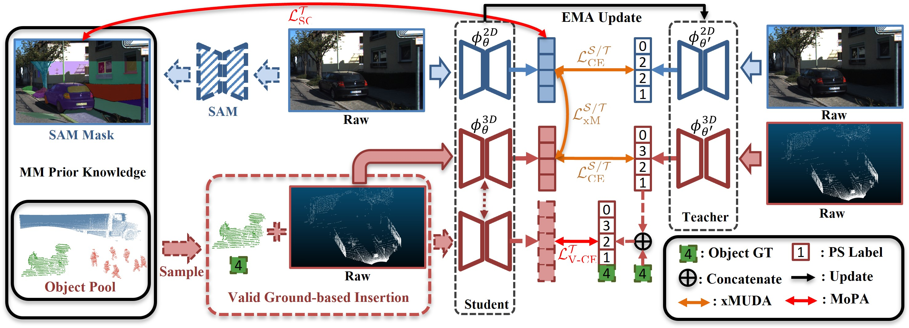
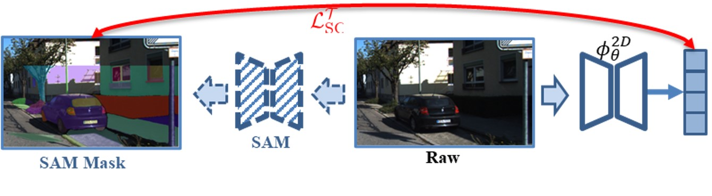

<h1 align="center">MoPA: Multi-Modal Prior Aided Domain Adaptation for <br> 3D Semantic Segmentation</h1>

<p align="center"><strong>
    <a href = "https://sites.google.com/view/haozhicao">Haozhi Cao</a><sup>1</sup>,
    <a href = "https://xuyu0010.wixsite.com/xuyu0010">Yuecong Xu</a><sup>2</sup>,
    <a href = "https://marsyang.site/">Jianfei Yang</a><sup>3*</sup>,
    <a href = "https://pamphlett.github.io/">Pengyu Yin</a><sup>1</sup>,
    <a href = "https://scholar.google.com/citations?user=XcV_sesAAAAJ&hl=en">Shenghai Yuan</a><sup>1</sup>,
    <a href = "https://scholar.google.com.sg/citations?user=Fmrv3J8AAAAJ&hl=en">Lihua Xie</a><sup>1</sup>
</strong></p>

<p align="center"><strong>
    <a href = "https://www.ntu.edu.sg/cartin">1: Centre for Advanced Robotics Technology Innovation (CARTIN), Nanyang Technological University</a><br>
    <a href = "https://cde.nus.edu.sg/ece/">2: Department of Electrical and Computer Engineering, National University of Singapor</a><br>
    <a href = "https://www.ntu.edu.sg/eee">3: School of EEE, Nanyang Technological University</a><br>
</strong></p>

<p align="center"><strong> 
    <a href = "https://arxiv.org/abs/2309.11839">&#128196; [Arxiv]</a> | 
    <a href = "https://youtu.be/kjjzzBdmm9E">&#127916; [Video]</a> |
    <a href = "https://ieeexplore.ieee.org/abstract/document/10610316/">&#128214; [IEEE<i>Xplore</i>]</a>
</strong></p>

## :scroll: About MoPA (ICRA'24)

MoPA is an MM-UDA method that aims to alleviate the imbalanced class-wise performance on Rare Objects (ROs) and the lack of 2D dense supervision signals through Valid Ground-based Insertion (VGI) and Segment Anything Mask consistency (SAM consistency). The overall structure is as follows.

<p align="middle">
  
</p>

Specifically, VGI insert more ROs from the wild with ground truth to guide the recognition of ROs during UDA process without introducing artificial artifacts, while SAM consistency leverages image masks from [Segment Anything Model](https://github.com/facebookresearch/segment-anything) to encourage mask-wise prediction consistency.

<p align="middle">
  
</p>

<p align="middle">
  
</p>

## Installation and Prerequisite

### 1. Installation
To ease the effort during environment setup, we recommend you leverage [Docker](https://www.docker.com/) and [NVIDIA Container Toolkit](https://docs.nvidia.com/ai-enterprise/deployment-guide-vmware/0.1.0/docker.html). With Docker installed, you can either locally build the docker image for MoPA using [this Dockerfile](docker/Dockerfile) by running ```docker build -t mopa docker/ ```, or pull our pre-built image from Dockerhub by ```docker pull aroncao49/mopa:latest```.

You can then run a container using the docker image. Before running our code in the container, some prerequisites are needed to be installed. To do so, go to this repo folder and run ```bash install.sh```.

Remarks: you may ignore the ERROR warning saying werkzeug version is not compatible with open3d.

### 2. Patchwork++
To install [Patchwork++](https://github.com/url-kaist/patchwork-plusplus) for ground identification, follow the below command:
```bash
# Make sure you are in this repo folder
$ mkdir mopa/third_party && cd mopa/third_party
$ git clone https://github.com/url-kaist/patchwork-plusplus
$ cd patchwork-plusplus && pip install .
```

## Dataset Prepatation
Please refer to [DATA_PREPARE.md](mopa/data/DATA_PREPARE.md) for the data preparation and pre-processing details.

## Training and Testing
Here we provide our pre-trained checkpoints for testing:
<table border="1" align="center">
  <tr>
    <td rowspan="2" valign="center">Method</td>
    <td colspan="4" align="center">
      USA&#8594;Singapore
    </td>
    <td colspan="4" align="center">
      Day&#8594;Night
    </td>
    <td colspan="4" align="center">
      A2D2&#8594;KITTI
    </td>
  </tr>
  <tr>
    <!-- U-to-S -->
    <th align="center">2D</th> <th align="center">3D</th> <th align="center">xM</th> <th align="center">ckpt</th>
    <!-- D-to-N -->
    <th align="center">2D</th> <th align="center">3D</th> <th align="center">xM</th> <th align="center">ckpt</th>
    <!-- A-to-S -->
    <th align="center">2D</th> <th align="center">3D</th> <th align="center">xM</th> <th align="center">ckpt</th>
  </tr>
  <tr>
    <td>xMUDA</td>
    <td>58.5</td> <td>51.2</td> <td>61.0</td> <td align="center"><a href="https://drive.google.com/drive/folders/1zxq6CUAkuxKLDlfSj5OvxXFcwR1T5sGG?usp=sharing">link</a></td>
    <td>47.7</td> <td>42.1</td> <td>52.3</td> <td align="center"><a href="https://drive.google.com/drive/folders/1-rlVfhh48XBity3q70RsKBza7f5baCZc?usp=sharing">link</a></td>
    <td>42.6</td> <td>44.9</td> <td>47.2</td> <td align="center"><a href="https://drive.google.com/drive/folders/1lsnxA4Hw_7uAktxpZZ0EZbyBL5WK3xlv?usp=sharing">link</a></td>
  </tr>
  <tr>
    <td>MoPA+PL</td>
    <td>61.8</td> <td>57.8</td> <td>64.5</td> <td align="center"><a href="https://drive.google.com/drive/folders/1NNY6kHoCaBhq1Ew0LynUjbJ1ZNzlUUYJ?usp=sharing">link</a></td>
    <td>51.9</td> <td>46.9</td> <td>54.8</td> <td align="center"><a href="https://drive.google.com/drive/folders/1_N4uQ4zicUtmOPsBbH576OH-ba98fL88?usp=sharing">link</a></td>
    <td>49.1</td> <td>56.2</td> <td>54.1</td> <td align="center"><a href="https://drive.google.com/drive/folders/1VsaMH5dgizZwnFoZTIdIWsprr_b0bAgT?usp=sharing">link</a></td>
  </tr>
  <tr>
    <td>MoPA+PLx2</td>
    <td>62.1</td> <td>56.8</td> <td>64.0</td> <td align="center"><a href="https://drive.google.com/drive/folders/1cT6aIhI7QdXayEBzMCLKF2E0k24oPDpc?usp=sharing">link</a></td>
    <td>51.7</td> <td>44.6</td> <td>55.3</td> <td align="center"><a href="https://drive.google.com/drive/folders/1J3iuO_2CvC_nUj9ycfXFcyAW6XBe9x9g?usp=sharing">link</a></td> 
    <td>50.0</td> <td>56.8</td> <td>54.7</td> <td align="center"><a href="https://drive.google.com/drive/folders/1lCBMLOwDnh2sN5KNEsf0DwnthhSMON9A?usp=sharing">link</a></td>
  </tr>
</table>
<br>

**Note**: During our refactoration, we find the same reproduction issue as in the vanilla xMUDA (as in this [issue](https://github.com/valeoai/xmuda/issues/18)), where the performance fluctuates among different runs. This happens much more frequently on NuScenes benchmarks (Day&#8594;Night especially), so we suggest you to use our provided checkpoints for performance validation.

Before conducting training and testing, you are suggested to create or an output directory to capture the logs and checkpoints, and link that folder to ```mopa/exp```.
### 1. Testing
To conduct testing on, for example, A2D2&#8594;KITTI, simply download and extract the checkpoints or prepare your own trained networks, and use the following command:
```bash
$ CUDA_VISIBLE_DEVICES=0 python mopa/test/test.py \\
      --cfg=configs/a2d2_semantic_kitti/xmuda_pl_pcmm_ema.yaml \\
      --model_prefix=/path/to/checkpoint/dir \\
      --ckpt2d=/2d_checkpoint/name \\
      --ckpt3d=/3d_checkpoint/name \\
```
The class-wise results will be stored as a *.xls file in your checkpoint folder.

To generate pseudo-labels for training, include the extra arguments in the command:
```bash
$ CUDA_VISIBLE_DEVICES=0 python mopa/test/test.py \\
      --cfg=configs/a2d2_semantic_kitti/xmuda_pl_pcmm_ema.yaml \\
      --pselab_dir=DIR_NAME \\
      VAL.BATCH_SIZE 1 DATASET_TARGET.TEST "('train',)"
```
The pseudo-labels will be stored in the folder ```ps_label/DIR_NAME``` under the dataset root dir.

### 2. Training
To conduct training with MoPA on, for example, A2D2&#8594;KITTI, simply use the following command:
```bash
$ CUDA_VISIBLE_DEVICES=0 python mopa/train/train_mopa.py \\
        --cfg=configs/a2d2_semantic_kitti/xmuda_pl_pcmm_ema.yaml \\
        DATASET_TARGET.SemanticKITTISCN.ps_label_dir DIR_NAME
```
You can also change those arguments in the config files directly.


## :eyes: Updates
* [2024.08] Our new MM-TTA paper for 3D segmentation has been accepted by ECCV 2024! Code will also be released soon. Check our [project site](https://sites.google.com/view/eccv24-latte) for more details!
* [2024.08] Release training/testing details and all checkpoints. We may further release the ROs we extracted if permitted.
* [2024.05] Release installation, prerequisite details, and data preparation procedures.
* [2024.03] We are now refactoring our code and evaluating its feasibility. Code will be available shortly. 
* [2024.01] Our paper is accepted by ICRA 2024! Check our paper on arxiv [here](https://arxiv.org/abs/2309.11839).

## :envelope: Contact
For any further questions, please contact [Haozhi Cao](https://sites.google.com/view/haozhicao) (haozhi002@ntu.edu.sg)

## :clap: Acknowledgement
We greatly appreciate the contributions of the following public repos:
- [torchsparse](https://github.com/mit-han-lab/torchsparse)
- [SPVNAS](https://github.com/mit-han-lab/spvnas)
- [SalsaNext](https://github.com/TiagoCortinhal/SalsaNext)
- [Patchwork++](https://github.com/url-kaist/patchwork-plusplus)
- [xMUDA](https://github.com/valeoai/xmuda)

## :pencil: Citation
```
@inproceedings{cao2024mopa,
  title={Mopa: Multi-modal prior aided domain adaptation for 3d semantic segmentation},
  author={Cao, Haozhi and Xu, Yuecong and Yang, Jianfei and Yin, Pengyu and Yuan, Shenghai and Xie, Lihua},
  booktitle={2024 IEEE International Conference on Robotics and Automation (ICRA)},
  pages={9463--9470},
  year={2024},
  organization={IEEE}
}
```
